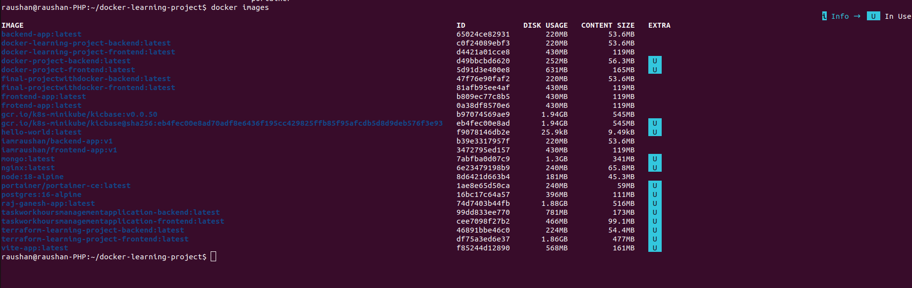
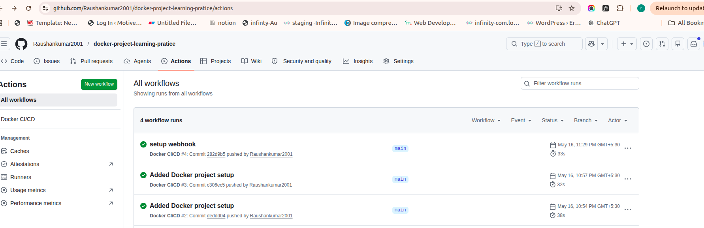

# 🚀 Full Stack Dockerized Application with GitHub Actions CI/CD


---

# 📖 Project Overview

This project is a full-stack Dockerized application built using React, Node.js, Express.js, and MongoDB.

The main goal of this project is to demonstrate how multiple services can be containerized, orchestrated, and automated using Docker Compose and GitHub Actions CI/CD workflows.

The application includes:

- React frontend application
- Express.js backend API
- MongoDB database
- Docker containerization
- Docker Compose orchestration
- GitHub Actions CI automation
- Persistent Docker volumes
- Service health checks
- Environment variable configuration

This project demonstrates practical DevOps concepts including containerization, CI/CD workflows, multi-container architecture, and automated development pipelines.

---

# ✨ Features

- Multi-container Docker architecture
- Frontend and backend containerization
- Docker Compose orchestration
- MongoDB persistent volume storage
- Internal Docker networking
- Environment variable support
- Automated GitHub Actions CI pipeline
- Service dependency management
- Health checks for containers
- Full-stack application communication

---

# 🏗️ System Architecture

```text
Browser
   |
   | http://localhost:5173
   v
Frontend Container
(React + Vite)
   |
   | API Requests
   v
Backend Container
(Node.js + Express)
   |
   | MongoDB Connection
   v
MongoDB Container
(Persistent Docker Volume)
```

---

# 🔄 CI/CD Workflow

```text
Developer Pushes Code
          |
          v
GitHub Repository
          |
          v
GitHub Actions Triggered
          |
          v
Install Dependencies
          |
          v
Build Frontend & Backend
          |
          v
Docker Compose Validation
          |
          v
CI Pipeline Completed
```

---

# 📸 Screenshots

## Application UI

> Add frontend screenshot here

## Docker Containers Running

> Add docker ps screenshot here

```md

```

## GitHub Actions Workflow

> Add GitHub Actions screenshot here

```md

```

---

# 🛠️ Tech Stack

| Category              | Technology          |
| --------------------- | ------------------- |
| Frontend              | React.js, Vite      |
| Backend               | Node.js, Express.js |
| Database              | MongoDB             |
| Containerization      | Docker              |
| Orchestration         | Docker Compose      |
| CI/CD                 | GitHub Actions      |
| ODM                   | Mongoose            |
| HTTP Client           | Axios               |
| Environment Variables | dotenv              |

---

# 📦 Services

| Service  | Technology        | Container Name     | Port  |
| -------- | ----------------- | ------------------ | ----- |
| Frontend | React + Vite      | frontend-container | 5173  |
| Backend  | Node.js + Express | backend-container  | 3001  |
| Database | MongoDB           | mongo-container    | 27017 |

---

# ⚙️ Docker Compose Setup

The project uses `docker-compose.yml` to manage and orchestrate all containers.

## Frontend Service

- Builds from `frontend/Dockerfile`
- Runs React application on port `5173`

## Backend Service

- Builds from `backend/Dockerfile`
- Runs Express server on port `3001`
- Connects with MongoDB container

## MongoDB Service

- Uses official MongoDB image
- Stores data using Docker volumes
- Connected with backend using Docker networking

## Docker Network

A shared Docker network enables communication between frontend, backend, and MongoDB containers.

## Persistent Volume

MongoDB data is stored using Docker volumes to prevent data loss after container restart.

## Health Checks

Health checks ensure dependent services are available before application startup.

---

# 🔧 GitHub Actions CI/CD

The project includes an automated GitHub Actions workflow for Continuous Integration (CI).

The workflow automatically runs whenever:

- Code is pushed to the repository
- A pull request is created

## CI Workflow Features

- Repository checkout
- Node.js environment setup
- Dependency installation
- Docker Compose validation
- Automated workflow execution
- Continuous Integration checks

## Workflow Location

```text
.github/workflows/
```

---

# 📁 Project Structure

```text
.
├── backend
│   ├── config
│   │   └── db.js
│   ├── Dockerfile
│   ├── package.json
│   └── server.js
│
├── frontend
│   ├── src
│   │   ├── App.jsx
│   │   └── main.jsx
│   ├── Dockerfile
│   ├── package.json
│   └── vite.config.js
│
├── screenshots
│   ├── app-ui.png
│   ├── docker-ps.png
│   ├── compose-logs.png
│   └── github-actions.png
│
├── .github
│   └── workflows
│       └── ci.yml
│
├── docker-compose.yml
└── README.md
```

---

# 🌐 API Endpoints

| Method | Endpoint    | Description                        |
| ------ | ----------- | ---------------------------------- |
| GET    | `/`         | Backend health check               |
| GET    | `/api/data` | Returns backend and MongoDB status |

---

# 🔐 Environment Variables

## Backend Environment

Create a `.env` file inside the `backend` folder.

```env
PORT=3001
MONGO_URI=mongodb://mongo:27017/docker-learning-project
```

---

## Frontend Environment

Create a `.env` file inside the `frontend` folder.

```env
VITE_API_URL=http://localhost:3001
```

---

# 🚀 How to Run the Project

## Clone Repository

```bash
git clone <repository-url>
cd docker-learning-project
```

---

## Build and Start Containers

```bash
docker compose up --build
```

---

## Access the Application

| Service  | URL                       |
| -------- | ------------------------- |
| Frontend | http://localhost:5173     |
| Backend  | http://localhost:3001     |
| MongoDB  | mongodb://localhost:27017 |

---

# 🐳 Useful Docker Commands

## Stop All Containers

```bash
docker compose down
```

---

## Remove Containers and Volumes

```bash
docker compose down -v
```

---

## Check Running Containers

```bash
docker ps
```

---

## View Container Logs

```bash
docker logs backend-container
```

---

## Rebuild Containers

```bash
docker compose up --build
```

---

# 📚 DevOps Concepts Demonstrated

- Docker containerization
- Multi-container architecture
- Docker Compose orchestration
- GitHub Actions CI/CD
- Continuous Integration workflows
- Persistent Docker volumes
- Docker networking
- Health checks
- Environment variable handling
- Full-stack application deployment

---

# 🔮 Future Enhancements

- AWS EC2 deployment
- Kubernetes deployment
- Nginx reverse proxy
- Prometheus & Grafana monitoring
- Multi-stage Docker builds
- Docker image optimization
- HTTPS & SSL setup
- Automated deployment pipeline

---

# 🎯 Learning Outcomes

This project helped in understanding:

- Docker fundamentals
- Multi-container deployments
- Docker Compose workflows
- CI/CD automation
- GitHub Actions pipelines
- Container networking
- Persistent storage using Docker volumes
- Backend and database communication
- DevOps workflow basics

---

# 👨‍💻 Author

**Raushan Kumar**

Frontend Developer transitioning into DevOps Engineering.

---
